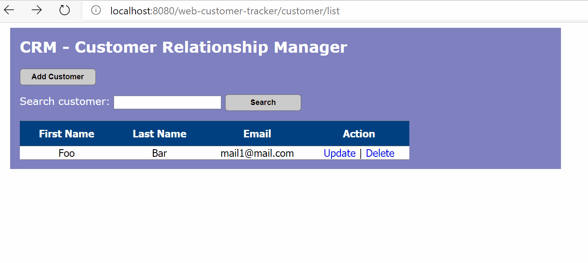
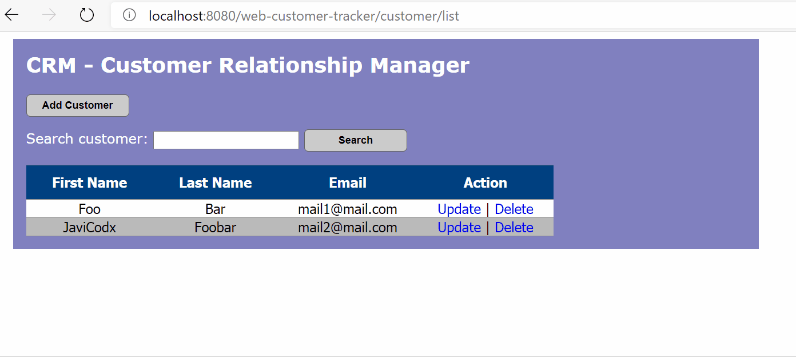
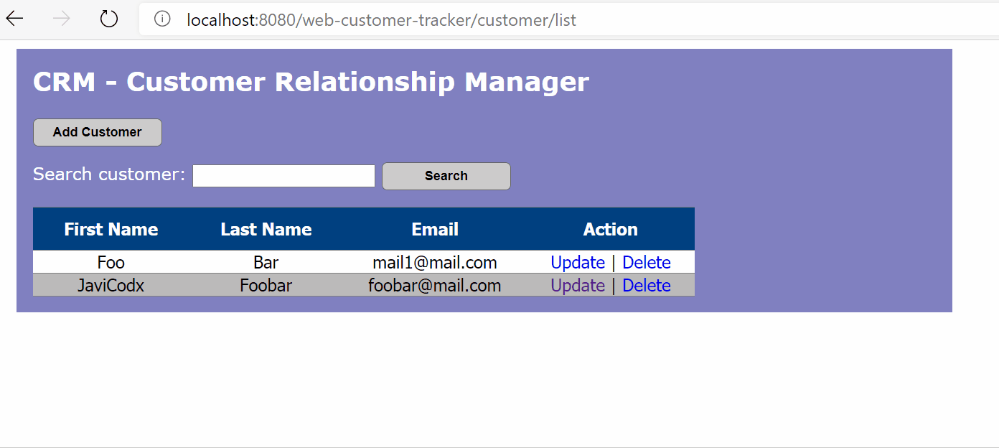
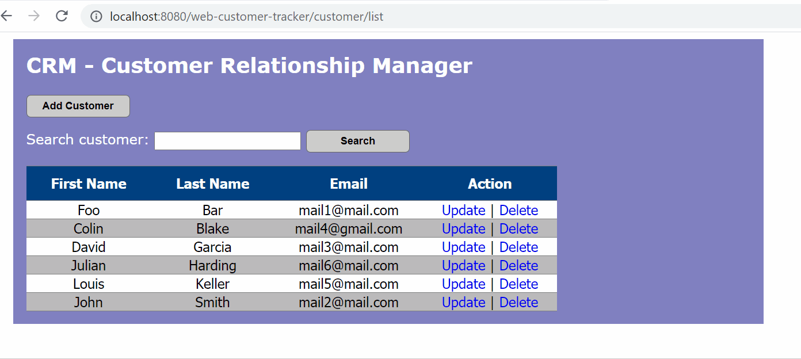

# SpringMVC-Hibernate-CRUD-App

This is a simple CRM(Customer Relationship Manager) web app made to learn SpringMVC alongside Hibernate framework, it supports simple CRUD operations such as adding,updating and deleting a customer as well as searching for one.

What I have learned/worked on in this project:
* SpringMVC
* Hibernate
* DAO - Service Pattern
* CRUD with Hibernate
* Setting up a Tomcat Server

## Adding a Customer

## Updating a Customer

## Deleting a Customer

## Searching for a Customer

